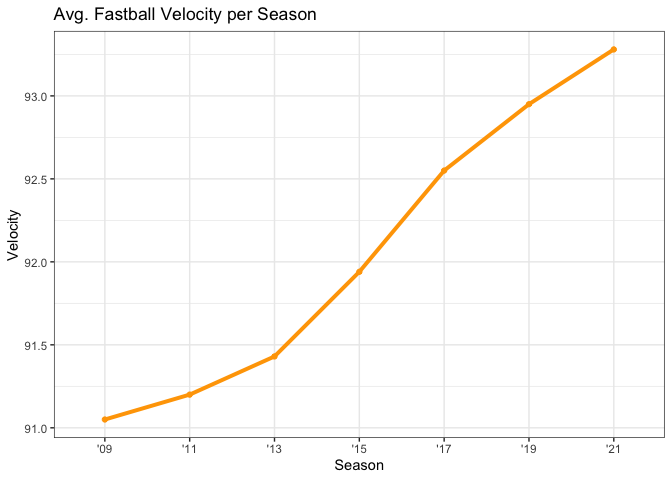
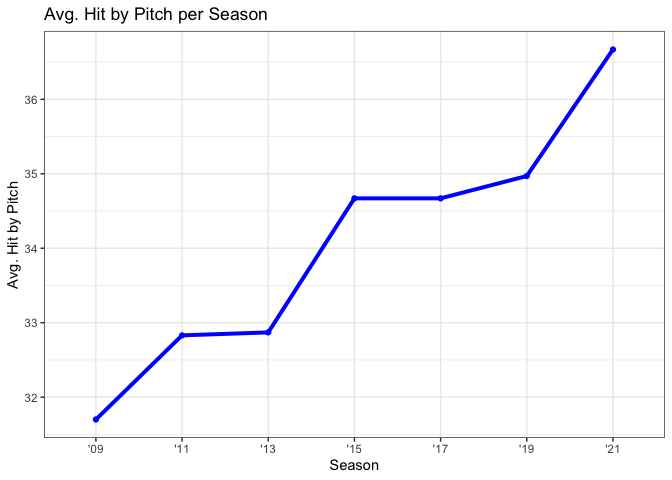

Personal-Data-Set-Project
================
Evan Howard
12/7/2021

It would seem that MLB’s focus on increased velocities stems from
increased focus on both biomechanics and specialized training. This is
proven with programs such as Driveline Baseball which has a significant
roll in using biomechanics and data analytics to implement their
training programs. However, could this increased focus on velocity be
having a negative effect on control? Could increased velocity lead to
more hit by pitches?

The data collecting, cleaning, and transforming were all fairly simple.
We downloaded the CSV from <https://www.fangraphs.com/>. From the
homepage of fangraphs we clicked on Team Stats. From there we went down
to the Multiple Seasons and entered 2007 to 2020. Then we went down to
the Custom Leaderboards and created our own Leaderboard by selecting the
columns Season, Team, Win, Loss, ERA, Base_on_Balls, HBP, WP, Balls,
Strikes, K/9, BB/9, K/BB, and Velo. After looking at the data we
realized that the 2020 season where there were only 60 games played
would be an outlier. We chose to exclude this data from our analysis. In
doing this we chose to only use odd numbered years in the data starting
with 2009 and ending with 2021.

    ## ── Attaching packages ─────────────────────────────────────── tidyverse 1.3.1 ──

    ## ✓ ggplot2 3.3.5     ✓ purrr   0.3.4
    ## ✓ tibble  3.1.5     ✓ dplyr   1.0.7
    ## ✓ tidyr   1.1.4     ✓ stringr 1.4.0
    ## ✓ readr   2.0.2     ✓ forcats 0.5.1

    ## ── Conflicts ────────────────────────────────────────── tidyverse_conflicts() ──
    ## x dplyr::filter() masks stats::filter()
    ## x dplyr::lag()    masks stats::lag()

<!-- --><!-- -->

    ## 
    ## Call:
    ## lm(formula = mean ~ hbp_mean)
    ## 
    ## Residuals:
    ##        1        2        3        4        5        6        7 
    ## -0.08026  0.43666  0.18612 -0.42388 -0.03715 -0.24722  0.16573 
    ## 
    ## Coefficients:
    ##             Estimate Std. Error t value Pr(>|t|)    
    ## (Intercept) 75.09172    2.62728  28.582 9.82e-07 ***
    ## hbp_mean     0.49819    0.07707   6.464  0.00132 ** 
    ## ---
    ## Signif. codes:  0 '***' 0.001 '**' 0.01 '*' 0.05 '.' 0.1 ' ' 1
    ## 
    ## Residual standard error: 0.3167 on 5 degrees of freedom
    ## Multiple R-squared:  0.8931, Adjusted R-squared:  0.8718 
    ## F-statistic: 41.78 on 1 and 5 DF,  p-value: 0.001319

Our analysis of the data concludes that a higher average velocity does
lead to a higher number of hit by pitches. As we can see the graphs both
trend upwards being very similar to each other. For every two mile per
hour increase we can expect our hit by pitches to increase by one.

We know that pitchers’ average velocity can’t increase exponentially. We
would expect there to be a ceiling for the increase in velocity. The
upper end of the average velocity graph seems like it may be flattening
out which might be the start of the ceiling for average velocity. More
time and data will have to be collected to see if this is true. However,
with more specialized training thanks to increased use of data and
biomechanics we can expect more pitchers to have higher average velocity
that can be sustained for longer periods of time. This may ultimately
lead to increases in hit by pitch incidents.

We note that more analysis needs to be done on individual pitches to see
which pitches have the most number of hit by pitches attributed to them.
There also needs to be more analysis done on individual pitchers as
opposed to teams to see if there is any correlation between the various
pitcher’s roles and hit by pitches.
